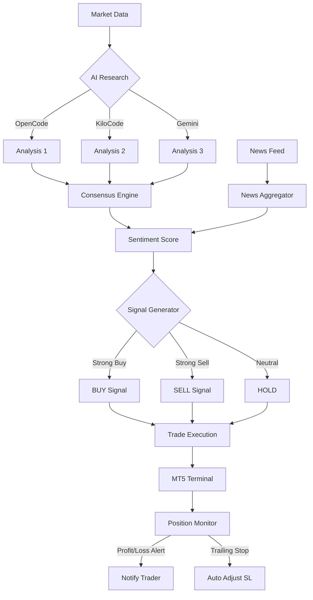

# 🦞 ClawGold

**ClawGold** is an AI-powered XAUUSD (Gold) trading system with multi-source news aggregation, sentiment analysis, and advanced trading strategies.

[](https://www.python.org/downloads/)
[](https://opensource.org/licenses/MIT)
[](https://www.metatrader5.com/)

<p align="center">
  
</p>

## Features

- **Phase 1: High-Impact Upgrades** ⚡
  - **LiteLLM Integration**: Unified AI provider interface (OpenCode, KiloCode, Gemini, Codex) with automatic fallback, retry logic, and cost tracking
  - **APScheduler Backend**: Robust persistent background task scheduling with job state recovery across restarts
  - **Rich Console Logging**: Enhanced console output with colors, panels, tables, and progress bars for better UX
  
- **Multi-AI Research**: Parallel search using multiple AI providers via LiteLLM
- **Sub-Agent System**: Dispatch tasks to AI CLI tools as autonomous agents (no model training)
- **Agent Scheduler**: Automated daily trading routines via APScheduler backend
- **LLM Observability**: Langfuse integration for tracing, cost tracking, and quality evaluation
- **News Aggregation**: Automated news collection with SQLite caching
- **Sentiment Analysis**: Real-time sentiment scoring from multiple sources
- **Trading Signals**: AI-generated buy/sell/hold signals with confidence scores
- **Advanced Strategies**: Trailing stops, grid trading, breakout detection, scalping
- **Multi-Timeframe Analysis**: EMA crossovers across M15, H1, H4, D1 timeframes
- **Risk Management**: Position sizing, daily loss limits, margin monitoring
- **Unified CLI**: Single command interface for all trading operations
- **Local-First**: Self-hosted database, no cloud dependencies

---

## Trading Flow



---

## Phase 1: Upgrade Overview

ClawGold v2.0 includes major architectural improvements for production reliability:

### What's New

| Feature | Before | After | Benefit |
|---------|--------|-------|---------|
| **AI Provider Interface** | Subprocess CLI calls | LiteLLM unified API | Automatic fallback, retries, cost tracking |
| **Task Scheduling** | Custom threading loop | APScheduler backend | Job persistence, thread pool, graceful shutdown |
| **Console Output** | Plain text logging | Rich formatted output | Colored logs, panels, tables, progress bars |
| **Cost Tracking** | Manual estimation | Automatic per-call logging | Real-time cost metrics in SQLite |
| **Job Recovery** | Lost on restart | Persisted to disk | Automatic recovery after crashes |

### New Dependencies

```bash
pip install litellm>=1.0.0 apscheduler>=3.10.0 rich>=13.0.0
```

### Backward Compatibility

✅ **100% backward compatible** — All existing APIs and command structures preserved. Phase 1 upgrades are internal improvements with no user-facing breaking changes.

---

## Architecture

```
┌─────────────────────────────────────────────────────┐
│          ClawGold Trading System                    │
├─────────────────────────────────────────────────────┤
│                                                     │
│  CLI Interface (claw.py)                           │
│  ├─ agent_executor.py (LiteLLM)                    │
│  ├─ agent_scheduler.py (APScheduler)               │
│  └─ sub_agent.py (LangGraph orchestration)         │
│                                                     │
│  ↓                                                  │
│                                                     │
│  LiteLLM Client → Multi-Provider AI Routing        │
│  ├─ OpenCode, KiloCode, Gemini, Codex              │
│  └─ Cost tracking, retry logic, fallback           │
│                                                     │
│  APScheduler → Background Job Management           │
│  ├─ Daily, interval, cron schedules                │
│  ├─ SQLite persistence                             │
│  └─ Thread pool execution (max 4 concurrent)       │
│                                                     │
│  Rich Logger → Enhanced Console Output             │
│  ├─ Colored terminal logging                       │
│  ├─ Panels, tables, progress bars                  │
│  └─ File logging to logs/clawgold.log              │
│                                                     │
│  Data Layer                                        │
│  ├─ data/llm_costs.db (LiteLLM cost tracking)     │
│  ├─ data/scheduler.db (APScheduler jobs)           │
│  ├─ data/agent_history.db (execution history)      │
│  └─ data/news.db (news & sentiment)                │
│                                                     │
│  ↓                                                  │
│                                                     │
│  MT5 Terminal → Trade Execution                    │
│                                                     │
└─────────────────────────────────────────────────────┘
```

---

## Getting Started

- Python 3.10+
- MetaTrader 5 (Windows)
- AI CLI Tools (at least one recommended):
  - `opencode` - OpenCode CLI (`opencode run "<prompt>"`)
  - `kilo` - KiloCode CLI (`kilo run "<prompt>"`)
  - `gemini` - Google Gemini CLI (`gemini "<prompt>"`)
  - `codex` - Codex CLI (`codex exec "<prompt>"`)

### Installation

1. Clone repo

```bash
git clone https://github.com/OpenKrab/ClawGold.git
cd ClawGold
```

2. Create virtual environment and install

```bash
python -m venv .venv
source .venv/bin/activate  # On Windows: .venv\Scripts\activate
pip install -r requirements.txt
```

3. Configure MT5 credentials in `.env`

```bash
cp .env.example .env
# Edit .env with your MT5 login credentials
```

4. Run validation

```bash
python claw.py validate
```

### Docker Deployment

Run full stack (app + db + dashboard):

```bash
docker compose up -d --build
```

Services:
- `app`: background news research worker (`scripts/news_worker.py`)
- `db`: shared SQLite volume initializer (`/data/news.db`)
- `dashboard`: Streamlit dashboard at `http://localhost:8501`

Useful commands:

```bash
# View logs
docker compose logs -f app
docker compose logs -f dashboard

# Stop stack
docker compose down
```

Notes:
- Linux containers do not support `MetaTrader5` package usage directly. The Docker stack is intended for news/sentiment workflows and dashboarding.
- Configure worker behavior via env vars: `RESEARCH_SYMBOL`, `RESEARCH_INTERVAL_SECONDS`, `RESEARCH_USE_AI`, `RESEARCH_QUERY`.

---

## Configuration

### config.yaml

```yaml
trading:
  mode: real                    # or 'simulation'
  symbol: XAUUSD
  risk_per_trade: 0.01

# Risk Management Settings
risk:
  max_positions: 5
  max_daily_loss: 500.0
  max_position_size: 1.0

# MT5 Credentials (prefer .env overrides)
mt5:
  login: 0
  password: ""
  server: ""

# Environment Variables (.env)
# MT5_LOGIN=12345678
# MT5_PASSWORD=your_password
# MT5_SERVER=MetaQuotes-Demo
```

---

## Core Commands

### Account & Market Data

```bash
# Check account balance
python claw.py balance

# Get current price
python claw.py price --symbol XAUUSD

# List open positions
python claw.py positions
```

### Trade Execution

```bash
# Execute market order
python claw.py trade BUY 0.1 --strategy breakout --market-condition trending --reason "H1 breakout + momentum"
python claw.py trade SELL 0.05 --strategy mean_reversion --market-condition ranging --reason "Fade resistance"

# Close positions
python claw.py close --all
python claw.py close --ticket 12345678
```

### Trade Journal & Analytics 📓

```bash
# Add manual journal entry (optional)
python claw.py journal add BUY --symbol XAUUSD --volume 0.1 --price 2950 --strategy breakout --market-condition trending --reason "NY breakout" --ai-snapshot "Bullish AI consensus"

# Win rate analysis (strategy / time bucket / market condition)
python claw.py journal analytics --days 90

# Equity curve tracking points
python claw.py journal equity --days 90
```

### Position Monitoring

```bash
# Monitor with alerts
python claw.py monitor --profit-alert 100 --loss-alert 50

# Apply trailing stop
python claw.py trailing-stop 12345678 --activation 15 --distance 10
```

---

## Advanced Trading Strategies

### Grid Trading

```bash
python claw.py grid --levels 5 --grid-size 10 --direction both --volume 0.1
```

### Breakout Detection

```bash
# Detect only
python claw.py breakout --symbol XAUUSD --lookback 20

# Detect and auto-trade
python claw.py breakout --symbol XAUUSD --execute --volume 0.1
```

### Multi-Timeframe Analysis

```bash
python claw.py analyze --symbol XAUUSD
```

### Scalping Strategy

```bash
python claw.py scalp --symbol XAUUSD --duration 30 --profit-target 5
```

---

## AI News Research System

The AI News system aggregates research from multiple AI tools in parallel.

### Research Commands

```bash
# Research with all AI tools
python claw.py news research XAUUSD --query "Fed interest rate impact on gold"

# Check sentiment
python claw.py news sentiment XAUUSD --trend --hours 72

# Get trading signal
python claw.py news signal XAUUSD
```

### AI Parallel Search

ClawGold simultaneously queries multiple AI tools and aggregates results:

| Tool | Purpose | Cache TTL |
|------|---------|-----------|
| OpenCode | Technical analysis | 6 hours |
| KiloCode | Market sentiment | 6 hours |
| Gemini | Fundamental outlook | 6 hours |

### Consensus Algorithm

```
AI Responses → Sentiment Extraction → Confidence Scoring → Consensus Signal
```

Example output:
```
Consensus: BULLISH
Agreement: 67%
Average Confidence: 78%
Signal: Moderate Buy
```

### LangGraph Stateful Orchestration (Multi-Agent)

ClawGold now supports stateful agent orchestration with LangGraph for resilient multi-step flows.

Highlights:
- Explicit node/edge workflow for daily multi-agent routine
- Stateful execution context across steps
- Deterministic step order and failure routing
- Better error containment for long workflows

Core integration points:
- `scripts/agent_graph.py` — LangGraph workflow definition
- `scripts/sub_agent.py` — uses LangGraph path in `daily_routine()` when available
- `scripts/agent_executor.py` — bridge API: `run_stateful_daily_flow()`

Example usage:

```python
from scripts.agent_executor import AgentExecutor

executor = AgentExecutor()
report = executor.run_stateful_daily_flow(symbol="XAUUSD", preferred_tool="gemini")
print(report["success"], report.get("orchestration"))
```

---

## 🤖 Sub-Agent System

ClawGold's Sub-Agent system dispatches tasks to external AI CLI tools (OpenCode, KiloCode, Gemini, Codex) as autonomous agents. **No model training required** — it leverages pre-trained AI via CLI commands.

### Architecture

```
User Request → SubAgent Orchestrator → AgentExecutor → AI CLI Tool
                     ↓                       ↓
              Role Assignment          Tool Discovery
              (researcher,              Cache Check
               analyst,                 Execution
               strategist,              History/Metrics
               monitor)                 Fallback Chain
```

### Agent Commands

```bash
# Run any task on a specific tool
python claw.py agent run gemini "What is the US CPI forecast?"

# Market research (researcher role)
python claw.py agent research "Gold outlook after NFP data"

# Technical analysis (analyst role)  
python claw.py agent analyze "XAUUSD support/resistance levels"

# Trading plan (strategist role)
python claw.py agent plan "XAUUSD trading plan for this week"

# Review positions with AI insight
python claw.py agent review

# Risk assessment
python claw.py agent risk

# News digest
python claw.py agent news "Fed monetary policy impact on gold"

# Full daily routine (5-step workflow)
python claw.py agent daily

# Quick consensus outlook (multiple tools)
python claw.py agent outlook

# List available CLI tools
python claw.py agent tools

# Execution history & performance
python claw.py agent history
python claw.py agent metrics
```

### Agent Scheduler (Automated Tasks)

```bash
# Start scheduler daemon
python claw.py agent schedule start

# View scheduled tasks
python claw.py agent schedule status

# View execution log
python claw.py agent schedule log

# Add custom task
python claw.py agent schedule add --name weekly_review --type daily --value "09:00" --task research --params '{"query":"Weekly XAUUSD review"}'

# Remove / toggle tasks
python claw.py agent schedule remove --name custom_task
python claw.py agent schedule toggle --name morning_research --state on
```

### Default Schedule

| Task | Time | Description |
|------|------|-------------|
| `morning_research` | 07:00 | Pre-market gold analysis |
| `morning_plan` | 07:30 | Trading plan generation |
| `midday_analysis` | 12:00 | Midday technical review |
| `position_check` | Every 10min | Monitor open positions |
| `afternoon_risk` | 15:00 | Risk assessment |
| `daily_summary` | 17:00 | End-of-day summary |
| `evening_research` | 20:00 | After-hours research |

### Supported AI CLI Tools

| Tool | Command | Purpose |
|------|---------|---------|
| OpenCode | `opencode run "<prompt>"` | General analysis, coding |
| KiloCode | `kilo run "<prompt>"` | Market analysis, research |
| Gemini | `gemini "<prompt>"` | Broad reasoning, summaries |
| Codex | `codex exec "<prompt>"` | Execution, code tasks |

The system auto-discovers which tools are installed and uses the best available one with fallback.

---

## 📊 LLM Observability with Langfuse

ClawGold integrates [Langfuse](https://github.com/langfuse/langfuse) for comprehensive observability and evaluation of all AI agent executions.

### What's Tracked

- **Prompts & Responses**: Every input/output from CLI tools captured
- **Execution Metrics**: Time, success rate, errors, cache hits
- **Cost Estimation**: Per-tool cost tracking across all agents
- **Quality Scores**: Manual/automatic evaluation of agent outputs
- **Agent Performance**: Success rates and latency per tool over time

### Setup

1. **Install Langfuse** (optional — observability is gracefully disabled if not configured):

```bash
pip install langfuse
```

2. **Get API Keys** from [Langfuse Cloud](https://cloud.langfuse.com) or self-hosted instance:
   - Public Key (API Key)
   - Secret Key

3. **Configure in `config.yaml`**:

```yaml
agent:
  langfuse:
    enabled: true
    api_key: "pk_..."              # Or env LANGFUSE_PUBLIC_KEY
    secret_key: "sk_..."           # Or env LANGFUSE_SECRET_KEY
    project_name: "clawgold"
    
    trace:
      agent_execution: true        # Trace individual CLI calls
      orchestrator_dispatch: true  # Trace SubAgent dispatch
      daily_routine: true          # Trace composite workflows
```

4. **Or use environment variables**:

```bash
export LANGFUSE_PUBLIC_KEY="pk_..."
export LANGFUSE_SECRET_KEY="sk_..."
python claw.py agent daily
```

### Dashboard Insights

In Langfuse, you'll see:

```
┌─ Project: clawgold
│
├─ Traces
│  ├─ agent:gemini (2024 runs)
│  ├─ agent:opencode (1843 runs)
│  ├─ orchestrator:research (432 runs)
│  └─ orchestrator:strategist (218 runs)
│
├─ Costs
│  └─ Total spent: $12.34
│  └─ By tool: Gemini $8.43 / OpenCode $2.91 / KiloCode $1.00
│
├─ Performance
│  └─ Gemini: 98% success, 2.3s avg latency
│  └─ OpenCode: 94% success, 4.1s avg latency
│
├─ Evaluations
│  └─ Quality scores, custom feedback
│  └─ Trend analysis over time
```

### Scoring Agent Outputs

Manually score executions via Langfuse UI, or programmatically:

```python
from scripts.langfuse_tracer import get_tracer

tracer = get_tracer(api_key="pk_...")
tracer.score_execution(
    trace_id="your-trace-id",
    score=0.92,
    comment="Accurate gold forecast, good confidence"
)
```

### Cost Tracking

Cost is estimated based on token count. Adjust rates in `config.yaml`:

```yaml
langfuse:
  cost_tracking:
    rates:
      gemini:        # per 1k tokens
        input: 0.00075
        output: 0.003
      opencode:
        input: 0.001
        output: 0.004
```

---

## Database Structure

### News Database (`data/news.db`)

| Table | Purpose |
|-------|---------|
| `news_articles` | Stored news and AI analysis |
| `ai_research` | Cached AI tool responses |
| `sentiment_history` | Sentiment trend tracking |
| `market_events` | Economic calendar events |
| `price_correlations` | News-to-price impact analysis |

### Maintenance

```bash
# View database stats
python claw.py news stats

# Clean old data (>30 days)
python claw.py news cleanup --days 30
```

---

## Project Structure

```
ClawGold/
├── claw.py                    # Main CLI entry point
├── config.yaml                # Configuration file
├── requirements.txt           # Python dependencies
│
├── scripts/
│   ├── mt5_manager.py        # MT5 connection handler
│   ├── risk_manager.py       # Risk management rules
│   ├── advanced_trader.py    # Trading strategies
│   ├── position_monitor.py   # Position alerts
│   │
│   ├── agent_executor.py     # AI CLI agent executor (unified)
│   ├── sub_agent.py          # Sub-agent orchestrator (5 roles)
│   ├── agent_scheduler.py    # Automated task scheduler
│   │
│   ├── news_db.py            # News database schema
│   ├── ai_researcher.py      # AI tool integrations
│   ├── trade_journal.py      # Trade journal + analytics engine
│   ├── sentiment_analyzer.py # Sentiment analysis engine
│   ├── news_aggregator.py    # News aggregation logic
│   │
│   ├── config_validator.py   # Config validation
│   ├── config_loader.py      # Config with env support
│   └── logger.py             # Unified logging
│
├── data/                     # Database storage
│   ├── news.db               # News & sentiment data
│   ├── clawgold.db           # Trade journal
│   ├── agent_history.db      # Agent execution history
│   ├── agent_scheduler.db    # Scheduler task state
│   └── agent_cache/          # Cached AI responses
│
├── logs/                     # Log files
└── .env.example              # Environment template
```

---

## Trading Workflow Example

### Daily Trading Routine

```bash
# Option A: Full automated daily routine via Sub-Agent
python claw.py agent daily

# Option B: Step-by-step manual
# 1. Morning analysis
python claw.py agent research "XAUUSD pre-market outlook"
python claw.py agent plan "XAUUSD trading plan for today"
python claw.py analyze
python claw.py news signal XAUUSD

# 2. If bullish signal with >70% confidence
python claw.py trade BUY 0.1

# 3. Apply risk management
python claw.py trailing-stop <ticket> --activation 20 --distance 10

# 4. Monitor positions
python claw.py monitor --profit-alert 100 --interval 10
```

### Automated Research

```bash
# Start the agent scheduler (runs in background)
python claw.py agent schedule start

# Or schedule daily AI research (cron)
0 8 * * * cd /path/to/ClawGold && python claw.py agent daily

# Check before each trade
python claw.py news sentiment XAUUSD --trend
```

---

## Risk Management

ClawGold includes multiple safety mechanisms:

| Feature | Description |
|---------|-------------|
| Position Size Limits | Max 1.0 lot per trade |
| Daily Loss Limit | Auto-stop at $500 loss |
| Margin Protection | Alert below 150% margin level |
| Max Positions | Limit 5 concurrent positions |
| Risk Per Trade | Default 1% of account |

---

## Testing

```bash
# Validate configuration
python claw.py validate

# Check MT5 connection
python claw.py balance

# Test news system (no AI)
python claw.py news research XAUUSD --no-ai
```

---

## Troubleshooting

### MT5 Connection Failed

```bash
# Check MT5 credentials
python claw.py validate

# Verify MT5 terminal path
# Default: C:\Program Files\MetaTrader 5\terminal64.exe
```

### AI Tools Not Found

```bash
# Install AI CLI tools
npm install -g opencode           # Usage: opencode run "<prompt>"
npm install -g @google/gemini-cli  # Usage: gemini "<prompt>"
# KiloCode: https://kilo.ai       # Usage: kilo run "<prompt>"
# Codex: https://codex.ai         # Usage: codex exec "<prompt>"

# Check which tools ClawGold detects:
python claw.py agent tools
```

### Database Locked

```bash
# Remove lock file
rm data/*.db-journal
```

---

## Environment Variables

| Variable | Purpose |
|----------|---------|
| `MT5_LOGIN` | MT5 account number |
| `MT5_PASSWORD` | MT5 password |
| `MT5_SERVER` | MT5 server name |
| `TRADING_MODE` | `real` or `simulation` |
| `RISK_PER_TRADE` | Risk percentage |

---

## Contributing

PRs are welcome! Areas for contribution:

- Additional trading strategies
- More AI tool integrations
- Enhanced sentiment models
- Web dashboard UI
- Telegram/Discord notifications

---

## Disclaimer

⚠️ **Trading Risk Warning**: Forex and CFD trading carries high risk. This software is for educational purposes. Always test with a demo account first. Past performance does not guarantee future results.

---

*Built for the Lobster Way 🦞*

## License

MIT License - see LICENSE file for details.
